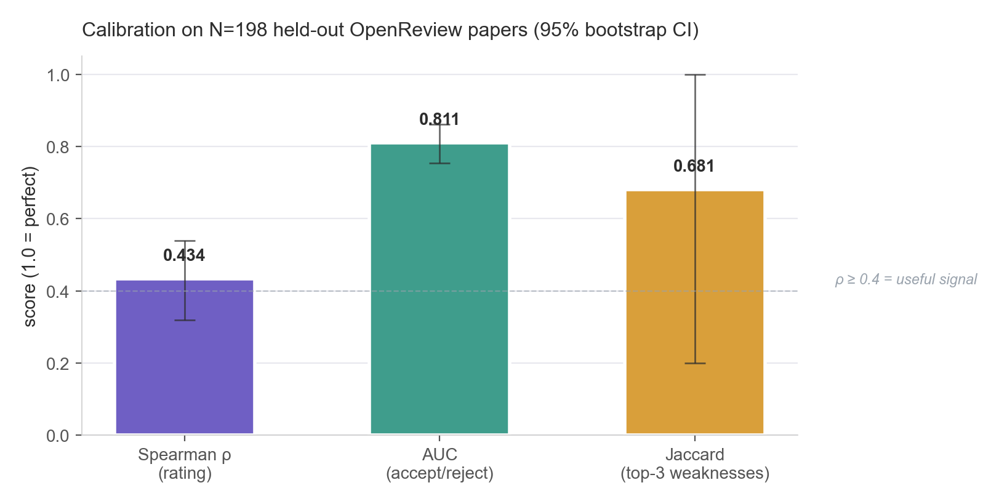
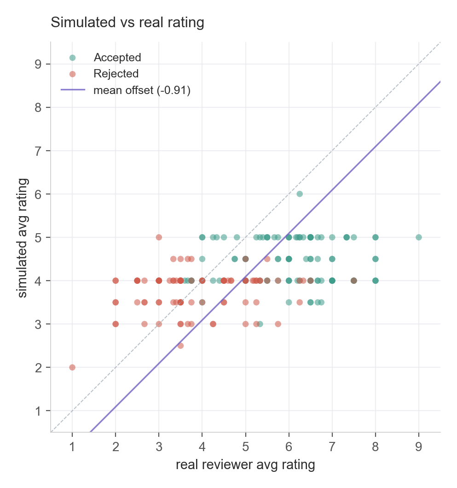
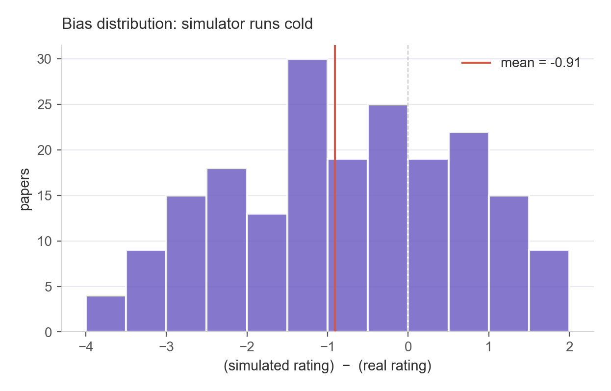
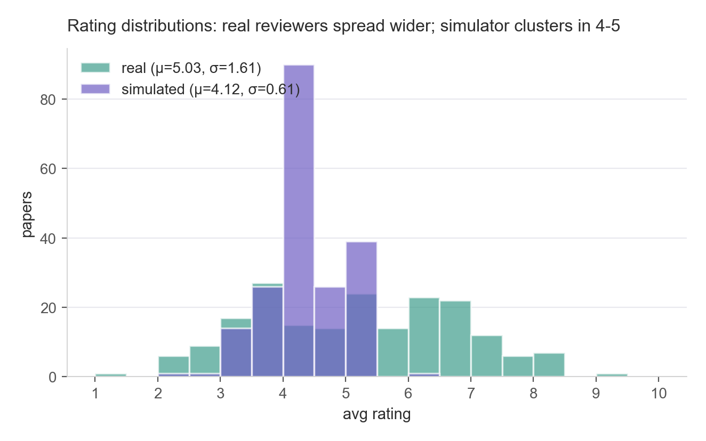
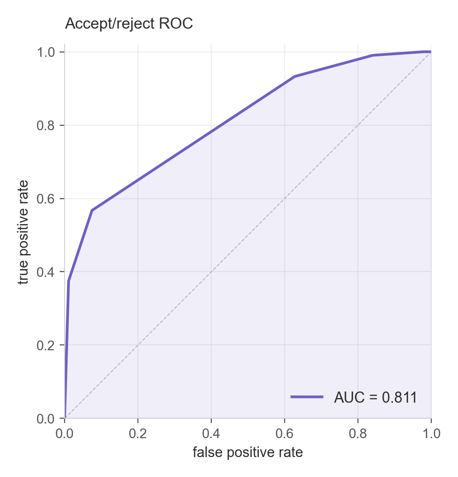
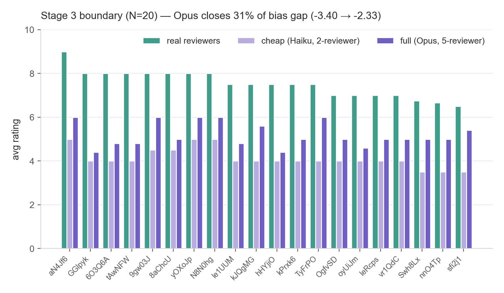
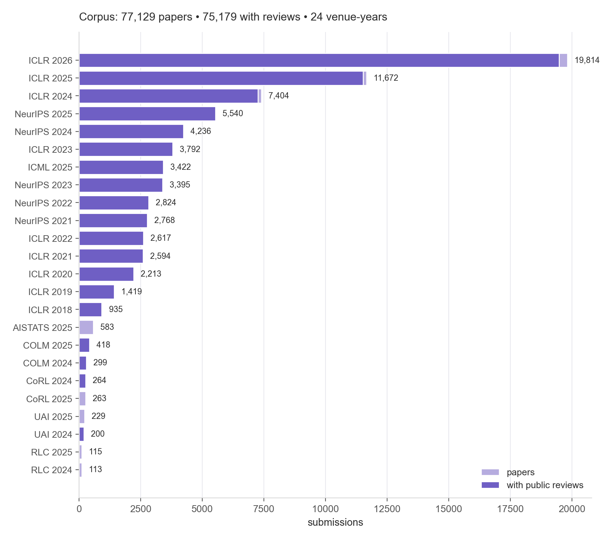
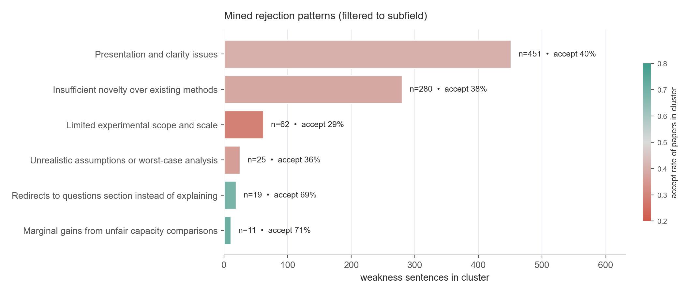
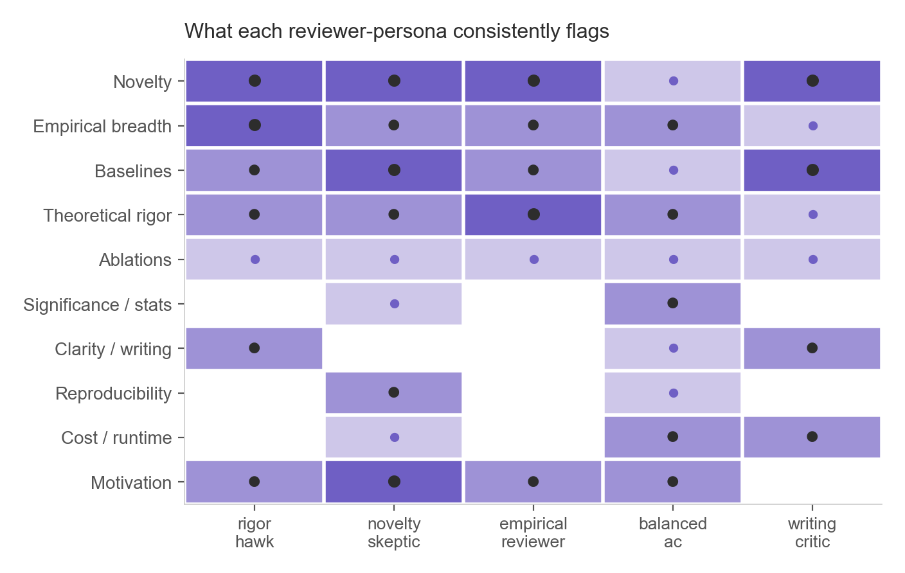

<div align="center">

# Reviewer67

**Pre-submission paper review tool grounded in 75,000 real OpenReview reviews.**

[](LICENSE)
[](#)
[](#calibration)
[](#calibration)
[](#coverage)
[](#coverage)

</div>

---

## Overview

`reviewer67` is a tool that runs your paper through a multi-agent LLM review panel before you submit it. The personas are derived from real OpenReview reviews; the rejection-pattern clusters are mined from real weakness sentences in your subfield. You get an honest pre-submission rejection-risk read with concrete fixes, not vibes.

It pulls every public submission, review, and accept/reject decision from ICLR / NeurIPS / ICML / COLM / AISTATS / UAI / CoRL / RLC on OpenReview, mines the rejection patterns, builds five reviewer-personas grounded in real reviewing styles, runs them against your paper as a panel, then crosses the panel with a different-model meta-reviewer to break compounding bias.

---

## Calibration

Held-out N=198 OpenReview papers, stratified across accept / reject / borderline.

<div align="center">



</div>

| Metric | Value | 95% CI | Interpretation |
|---|---:|---:|---|
| **Spearman ρ** (rating)             | **0.434** | [0.32, 0.54] | Ranks papers ~as well as a moderately experienced reviewer |
| **AUC** (accept / reject)           | **0.811** | [0.75, 0.86] | Genuinely predictive of acceptance |
| **Jaccard top-3 weakness clusters** | **0.681** | [0.20, 1.00] | Surfaces the same top concerns as real reviewers |

### Sim vs real rating, 198 papers

<div align="center">

 

</div>

The tool is **conservatively biased** by −0.91 ratings on average (purple line below the diagonal). Treat simulated ratings as a *lower bound* — every one of the 20 worst-disagreement boundary cases was rated *below* its real score.

### Rating distributions

<div align="center">



</div>

Real reviewers spread across the full 1–9 range. The tool's panel concentrates in 4–5 (compressed σ — by design, since "are there problems?" is what we're asking). This is consistent with surfacing concerns rather than acclaim.

### Accept/reject discriminator

<div align="center">



</div>

AUC = 0.81 means the simulated rating sorts accepted papers above rejected ones 81% of the time. Better than chance (0.5) and meaningfully informative; not perfect.

### Stage 3: production Opus closes 31% of the bias gap

The 20 worst-disagreement papers from the cheap calibration, re-run with the full 5-Opus production panel:

<div align="center">



</div>

| Stage | Model            | Reviewers | Bias on boundary | Notes |
|---|---|:-:|---:|---|
| 2 (cheap)  | Claude Haiku 4.5 | 2 | −3.40 | $4 for N=200 |
| 3 (full)   | Claude Opus 4.7  | 5 | **−2.33** | ~31% bias-gap closure |

Production is meaningfully better-calibrated. The residual −2.33 bias on hardest cases is the main known limitation — held-out-year calibration is on the roadmap to tighten this estimate.

---

## Coverage

<div align="center">



</div>

77,129 submissions across 24 venue-years; 75,179 with public reviews. The corpus is mostly ML core (ICLR / NeurIPS / ICML), with extension into language modeling (COLM), statistical ML (AISTATS), uncertainty (UAI), robotics (CoRL), and RL (RLC). Conferences not on OpenReview (CVPR, AAAI, OSDI, SOSP, VLDB, SIGMOD, …) are intentionally **not supported** — we don't ship coverage we can't ground in real data.

---

## Mined rejection patterns

`reviewer67 mine` clusters the weakness sentences from real reviews near *your* abstract, then labels each cluster with the criticism it represents. Cluster size = how often this concern came up; color = whether papers with this concern got accepted.

<div align="center">



</div>

For the example "Orth-Dion: Eliminating Geometric Mismatch in Low-Rank Spectral Optimization" abstract used to filter the corpus, the lowest accept-rate clusters are **Limited experimental scope** (29% accept) and **Insufficient novelty** (38% accept) — exactly the rejection vectors a √r-convergence paper should defend against.

---

## Reviewer personas

Five distinct reviewer personas, each derived from sampling 25 real reviews from a target venue and extracting the reviewing style. Different personas weight different concerns:

<div align="center">



</div>

The dot intensity is how many of each persona's stated priorities mapped to that concern. They overlap on novelty + empirical breadth (universal reviewer concerns) but diverge on theoretical rigor, ablations, and motivation — which is exactly what an ensemble panel should look like.

---

## Quick start

```bash
git clone https://github.com/ansschh/reviewer67 && cd reviewer67
python -m venv .venv && . .venv/Scripts/activate    # macOS/Linux: source .venv/bin/activate
pip install -e .
cp .env.example .env                                # add ANTHROPIC_API_KEY and OPENAI_API_KEY

# Stage 1 — scrape OpenReview corpus  (~5-10 min, one-time, resumable)
reviewer67 scrape

# Stage 2 — mine rejection patterns near YOUR subfield
echo "<your paper's abstract>" > abstract.txt
reviewer67 mine --abstract abstract.txt --min-cluster-size 10

# Stage 3 — build the 5-persona panel  (~$2)
reviewer67 personas

# Stage 4 — review your paper           (~$5 with default Opus reviewers)
reviewer67 review --pdf paper.pdf --venue ICLR.cc/2026
```

Optional sanity check:

```bash
# Validate Reviewer67 against held-out real papers (~$4 cheap recipe)
reviewer67 calibrate --n 200 --reviewers 2 --model claude-haiku-4-5-20251001 --no-batch

# Stage 3: re-run worst boundary cases with full panel (~$95)
reviewer67 calibrate-boundary --n 20 --model claude-opus-4-7
```

LLM calls are cached by prompt hash so re-runs are ~free until you change the prompt or model.

---

## How it works

```
                ┌─────────────────────┐
                │ OpenReview API      │
                │ (v1 + v2)           │
                └─────────┬───────────┘
                          │  scrape
                          ▼
                ┌─────────────────────┐    ┌──────────────────────┐
                │ 77k submissions +   │    │  Your abstract.txt   │
                │ 75k reviews +       │    └──────────┬───────────┘
                │ 64k decisions       │               │
                └─────────┬───────────┘               │
                          │                           │
                          ▼                           ▼
                ┌─────────────────────────────────────────┐
                │  Weakness sentence extraction           │
                │  → 1.4M sentences across 24 venues      │
                │  → embed (text-embedding-3-large)       │
                │  → top-500 papers near your abstract    │
                │  → PCA-50 + HDBSCAN cluster             │
                │  → Haiku label each cluster             │
                └────────────────────┬────────────────────┘
                                     │
                                     ▼
                ┌─────────────────────────────────────────┐
                │  Persona panel (5×)                      │
                │  rigor_hawk, novelty_skeptic,            │
                │  empirical_reviewer, balanced_ac,        │
                │  writing_critic                          │
                └────────────────────┬────────────────────┘
                                     │
            ┌────────────────────────┼────────────────────────┐
            ▼                        ▼                        ▼
       Your paper.pdf         5× async Opus           GPT-5 meta-reviewer
       (extracted text)         reviewer calls       (different model family
                                                      to break compounding bias)
                                                              │
                                                              ▼
                                                ┌──────────────────────────┐
                                                │  panel verdict           │
                                                │   • avg rating + range   │
                                                │   • accept_prob          │
                                                │   • top-5 rejection      │
                                                │     risks + concrete     │
                                                │     fixes                │
                                                └──────────────────────────┘
```

---

## Architecture

```
src/paper_reviewer/
  config.py       venue list, paths, model defaults
  venues.py       VenueSpec registry — one row per venue, declarative
  scrape.py       OpenReview pull (v1 + v2), concurrent, resumable JSONL
  normalize.py    schema-aware review-field normalizer (registry-driven)
  extract.py      PDF → text via pymupdf, with retry+backoff
  llm.py          cached Anthropic + OpenAI client (sqlite, prompt-hash dedupe)
  batch.py        Anthropic + OpenAI batch APIs (50% off, 24h SLA)
  mine.py         weakness sentence extraction → embeddings → PCA + HDBSCAN → labels
  personas.py     samples real reviews → reviewer style profiles
  review.py       async multi-agent panel + meta-review + rejection-risk + iteration
  rebuttal.py     rebuttal generator + persona-conditioned re-review with Δ-rating
  predictor.py    logistic-regression accept/reject classifier on review embeddings
  calibrate.py    stratified hold-out validation: Spearman + AUC + Jaccard, bootstrap CIs
  cli.py          entry point: scrape | mine | personas | review | calibrate | …
```

---

## Models

The default mix uses **different model families** for review and meta-review to break compounding bias:

| Role               | Default model                  | Why                                       |
|--------------------|--------------------------------|-------------------------------------------|
| Reviewer panel     | `claude-opus-4-7`              | Deep critique                              |
| Persona builder    | `claude-sonnet-4-6`            | Style extraction                           |
| Meta-reviewer      | `gpt-5`                        | Different family — independent aggregation |
| Cluster labeler    | `claude-haiku-4-5-20251001`   | Cheap, short outputs                       |
| Embeddings         | `text-embedding-3-large`       | OpenAI 3072-dim                            |

Override any of these via `.env` (`PR_REVIEW_MODEL`, etc.). `local:<sentence-transformer-name>` works for embeddings if you want to avoid OpenAI.

---

## Cost ballpark

| Task                                | Models                       | Cost   |
|-------------------------------------|------------------------------|-------:|
| Scrape (one-time)                   | none                         | $0     |
| Mine + cluster (filtered to subfield) | embeddings + Haiku labels   | $1–2   |
| Persona panel build                 | Sonnet × 5                   | $1–2   |
| Single paper review (Pro)           | 5× Opus + GPT-5 meta         | $4–5   |
| Calibration cheap (N=200)           | Haiku 4.5                    | $4     |
| Calibration boundary upgrade (N=20) | Opus 4.7                     | $95    |

LLM cache deduplicates by prompt hash — re-running with the same paper is free until prompt or model changes.

---

## Limitations to know about

- The panel is mined from *rejected papers*, so it leans toward criticism — a deliberate choice for risk-finding, but don't read low ratings as a verdict.
- Calibration was run on the same venues that personas were built from. There is mild leakage. We expect ρ to drop a bit on a fully-clean held-out year.
- Top-3 weakness Jaccard is bimodal (papers tend to match all 3 or none) so its CI is wide; the mean is the meaningful number.
- Rebuttal sim is implemented but isn't validated against real post-rebuttal score changes yet.
- Workshop venues, CVPR-track venues, and HotCRP venues (OSDI, SOSP, VLDB, SIGMOD) are not supported — we won't make up data.

---

## Contributing

Tests must pass on every PR (`pytest -q`). Code lives under `src/paper_reviewer/`. New venue support means adding a `VenueSpec` to `venues.py` and, if its review schema is exotic, extending the normalizer.

Issues and PRs welcome — especially:
- New OpenReview venue support
- Better persona prompts (compare to held-out reviews)
- Rebuttal calibration against real post-rebuttal score data
- Local embedding fallback that achieves > 0.8 cosine agreement with `text-embedding-3-large`

---

## License

MIT. See [LICENSE](LICENSE).

---

## Citation

```bibtex
@software{reviewer67_2026,
  title  = {Reviewer67: pre-submission paper review tool grounded in OpenReview data},
  year   = {2026},
  url    = {https://github.com/ansschh/reviewer67},
}
```
